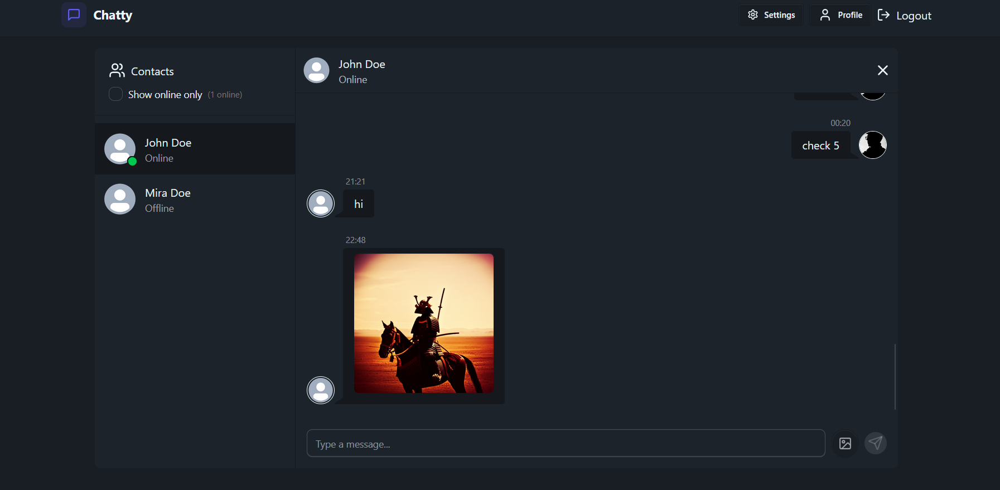
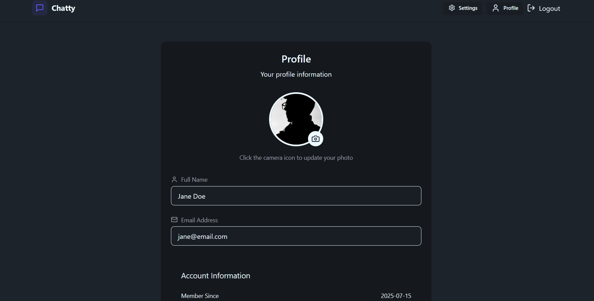
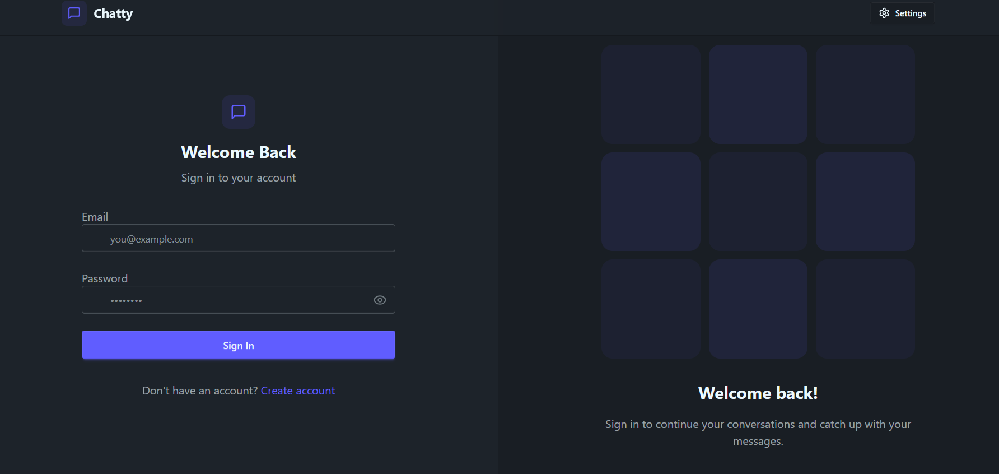
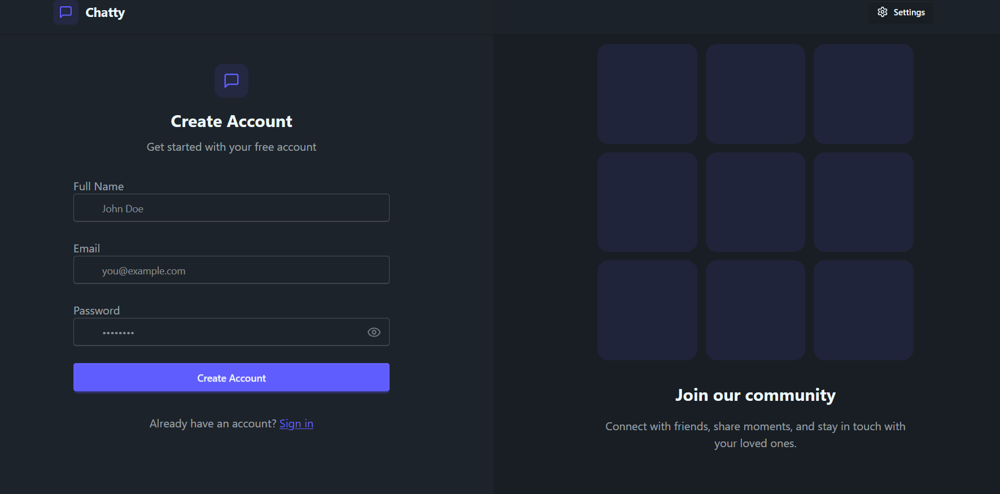

# MERN Chat Application

A real-time, full-featured chat application built with the MERN stack (MongoDB, Express.js, React.js, and Node.js). This project demonstrates modern web development skills, scalable architecture, and robust real-time communication!

---

## 🚀 Features

- **User Authentication**  
  Secure login/register using JWT-based authentication.

- **Real-Time Messaging**  
  Instantly send and receive messages in real-time using Socket.io — no page refresh needed.

- **Online/Offline Presence**  
  See who is online and their activity status.

- **Responsive Design**  
  Works seamlessly on desktop, tablet, and mobile devices.

- **Message History**  
  Persistent chat history stored in MongoDB.

- **Profile Management**  
  Update user profile avatar.

- **Messaging**  
  Support for both text and images in messaging layer.

---

 <!-- Replace -->
 <!-- Replace -->
 <!-- Replace -->
 <!-- Replace -->

---

## 🧱 Tech Stack

| Layer                   | Framework & Tools                                                                    |
| ----------------------- | ------------------------------------------------------------------------------------ |
| Backend                 | Node.js, Express.js                                                                  |
| Database                | MongoDB with Mongoose, Cloudinary for storing images                                 |
| Real time communication | Socket.io                                                                            |
| Frontend                | React.js (React hooks), Zustand (for global states), TailwindCSS (for responsive UI) |

---

## ⚙️ Installation & Development

1. **Clone the repo**

   ```bash
   git clone https://github.com/ArnabDey31/mern-chat-application.git
   cd mern-chat-application
   ```

2. **Install dependencies**
   ```bash
   cd server && npm install
   cd ../frontend && npm install
   ```
3. **Configure environment variables**

   Create a .env file inside the server directory:

   ```bash
   MONGODB_URI=<your MongoDB connection string>
   PORT=5001
   JWT_SECRET=<secret key>
   NODE_ENV=development
   CLOUDINARY_CLOUD_NAME=<your cloudinary cloud name>
   CLOUDINARY_API_KEY=<your cloudinary api key>
   CLOUDINARY_API_SECRET=<your cloudinary api secret>
   ```

4. **Run the App**
   ```bash
   cd server && npm run dev
   cd ../frontend && npm run dev
   ```
5. **Launch the App**

   http://localhost:5173/
